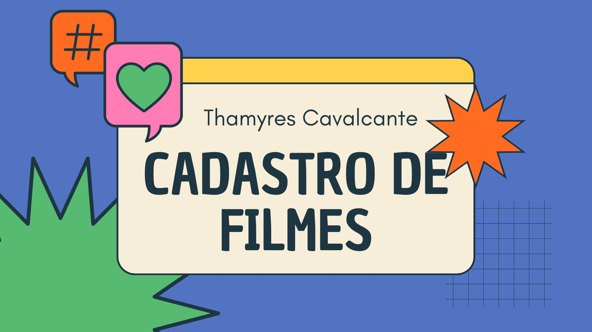
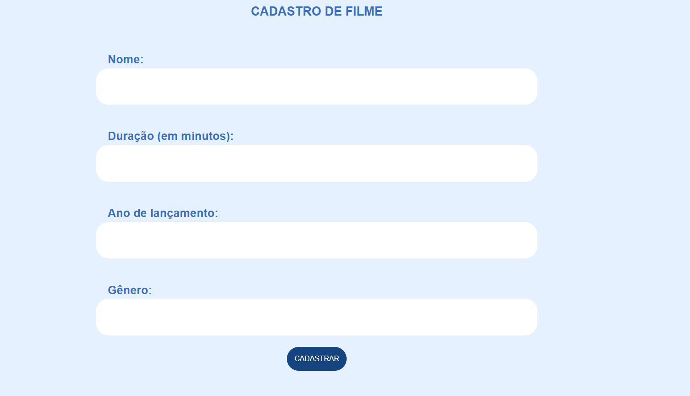
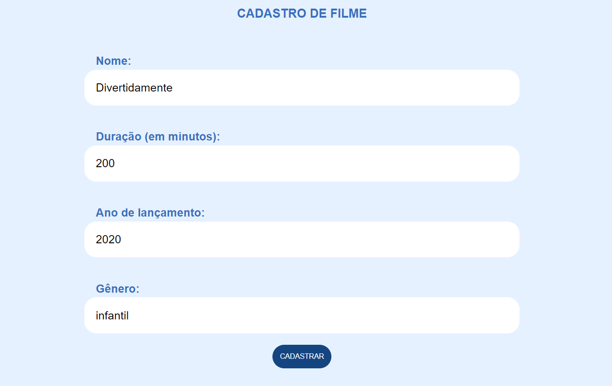
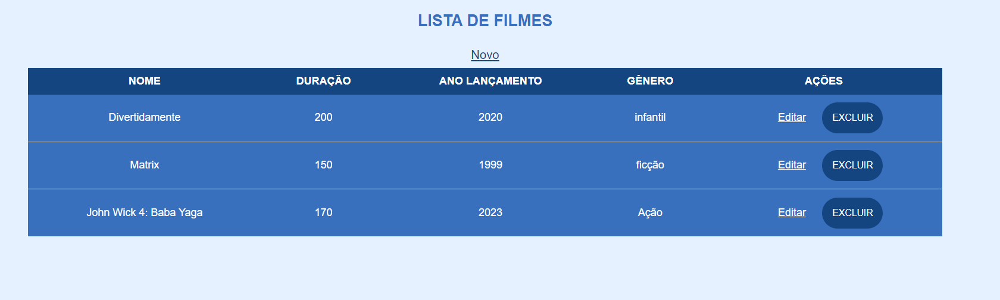

# Projeto de Cadastro de filmes

| :placard: Vitrine.Dev |     |
| -------------  | --- |
| :sparkles: Nome        | **Projeto Cadastro de filmes**
| :label: Tecnologias | HTML, CSS, Java, Spring Boot, MVC, Data JPA, 
|  | Thymeleaf, MySQL
| :rocket: URL         | https://github.com/Thamyresmya/Cadastro-de-filmes

 

  <a href="#-tecnologias">Tecnologias</a>&nbsp;&nbsp;&nbsp;|&nbsp;&nbsp;&nbsp;  
  <a href="#-projeto">Projeto</a>&nbsp;&nbsp;&nbsp;|&nbsp;&nbsp;&nbsp;  
  <a href="#-gif">Gif</a>&nbsp;&nbsp;&nbsp;&nbsp;&nbsp;&nbsp;

 

## 🚀 Tecnologias

Esse projeto foi desenvolvido com as seguintes tecnologias:

- HTML
- CSS
- Java
- Spring
- Thymeleaf 
- MySQL
- Maven
- Spring Data JPA
- Git e Github

 

## 💻 Projeto

Projeto de cadastro de filmes desenvolvido em Java com Spring boot. Criação de CRUD, com estruturas de controle e injeção de dependência. Páginas web dinâmicas utilizando Thymeleaf, banco de dados MySQL para persistir os dados da aplicação, criação de esquema do banco de dados e tabelas, controle de versionamento com flyway, e utilização do Spring Data JPA para interagir com o banco de dados de forma eficiente.

 

## 📁 Acesso ao projeto

É possível acessar o projeto através do [Link](https://github.com/Thamyresmya/Cadastro-de-filmes)

 

## 📸 Gif

</img>

Cadastro de filmes

</img>

Alteração de cadastro

</img>

Listar filmes

</img>

 

Me siga nas redes sociais:
- [Linkedin](https://www.linkedin.com/in/thamyrescavalcante/)
- [Instagran](https://www.instagram.com/thamyres__cavalcante/)

 

---

Feito com ♥ by Thamyres Cavalcante.

